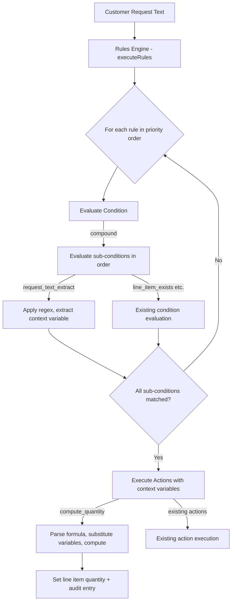

# Design Document: Context-Aware Quantity Rules

## Overview

This feature extends the existing rules engine with the ability to extract numeric and categorical context from customer request text and use that context to compute line item quantities via configurable formulas. The current rules engine can only set static quantity values (e.g., "set quantity to 4"). This design adds three new capabilities:

1. **Context extraction** — A new condition type (`request_text_extract`) that applies a regex with a named capture group against the customer request text, extracting a value into a scoped context variable.
2. **Compound conditions** — A new condition type (`compound`) that ANDs multiple sub-conditions together, enabling rules that combine product matching with context extraction.
3. **Computed quantities** — A new action type (`compute_quantity`) that evaluates a safe arithmetic formula referencing extracted context variables to set a line item's quantity.

These additions are purely additive — existing condition types, action types, and the iteration/convergence model remain unchanged. The formula evaluator is a minimal safe expression parser (no `eval`, no arbitrary code execution) that supports only arithmetic operations on numeric literals and context variable references.

### Design Rationale

- **No AI dependency at runtime**: Quantity computation is fully deterministic, using regex extraction + arithmetic. This keeps the rules engine fast and predictable.
- **Scoped context variables**: Variables extracted by one rule are not visible to other rules. This prevents ordering-dependent bugs and keeps rules self-contained.
- **Formula validation at creation time**: Invalid formulas are rejected when the rule is saved, not when a quote is generated. This gives immediate feedback to the user.
- **Preset patterns**: Common extraction patterns (sqft, rooms, floors) are provided as presets to avoid requiring regex knowledge for typical use cases.

## Architecture

The feature integrates into the existing rules engine pipeline without changing the execution model:



### Key Architectural Decisions

1. **Formula evaluator is a recursive-descent parser** — Not `eval()` or `Function()`. This ensures only arithmetic expressions are executable and prevents code injection.
2. **Context variables are passed as a `Map<string, number>`** — Extracted during condition evaluation, consumed during action execution, scoped to a single rule's evaluation cycle.
3. **Preset patterns resolve at rule creation time** — The resolved regex is stored in `condition_json`. This means rule evaluation never depends on preset definitions, and presets can be updated without affecting existing rules.
4. **Compound conditions use short-circuit evaluation** — Sub-conditions are evaluated in order; if any fails, remaining sub-conditions are skipped.

## Components and Interfaces

### New Condition Types

```typescript
/** Extract a value from request text via regex capture group */
interface RequestTextExtractCondition {
  type: 'request_text_extract';
  pattern: string;           // Regex with exactly one capture group
  variableName: string;      // Name for the extracted context variable
  preset?: string;           // Optional: preset name that generated this pattern
}

/** Combine multiple sub-conditions with AND logic */
interface CompoundCondition {
  type: 'compound';
  conditions: RuleCondition[]; // All must match; supports all existing + request_text_extract
}
```

### New Action Type

```typescript
/** Compute a quantity from a formula using context variables */
interface ComputeQuantityAction {
  type: 'compute_quantity';
  productNamePattern: string;  // Which line items to target
  formula: string;             // Arithmetic expression (e.g., "sqft / 100 * 4")
  matchMode?: MatchMode;       // Optional: exact, starts_with, contains
}
```

### Formula Evaluator Module

A new pure module `worker/src/services/formula-evaluator.ts`:

```typescript
export interface FormulaValidationResult {
  valid: boolean;
  error?: string;
  referencedVariables: string[];  // Variable names found in the formula
}

/** Validate formula syntax and extract referenced variable names */
export function validateFormula(formula: string): FormulaValidationResult;

/** Evaluate a formula with the given variable bindings. Returns the numeric result. */
export function evaluateFormula(
  formula: string,
  variables: Map<string, number>,
): number;  // Throws on division by zero, overflow, or missing variable
```

The formula grammar supports:
- Numeric literals: integers and decimals (e.g., `100`, `3.5`)
- Variable references: identifiers matching `[a-zA-Z_][a-zA-Z0-9_]*`
- Operators: `+`, `-`, `*`, `/` with standard precedence
- Parentheses for grouping
- Unary minus (e.g., `-1`)

### Extraction Pattern Presets Module

A new module `worker/src/services/extraction-presets.ts`:

```typescript
export interface ExtractionPreset {
  id: string;
  name: string;
  description: string;
  pattern: string;          // Regex string with one capture group
  variableName: string;     // Default variable name
  exampleMatches: string[]; // Example strings that match
}

/** Get all available extraction presets */
export function getExtractionPresets(): ExtractionPreset[];

/** Resolve a preset ID to its pattern. Returns null if not found. */
export function resolvePreset(presetId: string): ExtractionPreset | null;
```

Predefined presets:

| Preset ID | Variable Name | Pattern | Matches |
|-----------|--------------|---------|---------|
| `sqft` | `sqft` | `(\d[\d,]*(?:\.\d+)?)\s*(?:sq\.?\s*ft\|sqft\|square\s*feet\|sf)` | "1500 sqft", "1,500 sq ft", "1500 square feet", "1500sf" |
| `room_count` | `rooms` | `(\d+)\s*(?:rooms?\|bedrooms?\|bathrooms?\|bed/?bath)` | "3 rooms", "3 bedrooms", "3 bathrooms", "3 bed/bath" |
| `floor_count` | `floors` | `(\d+)\s*(?:floors?\|stor(?:y\|ies)\|levels?)` | "2 floors", "2 stories", "2 levels", "2-story" |

### Extended Condition Evaluator

The existing `evaluateCondition` function is extended to handle the two new condition types. It returns an enhanced result that includes extracted context variables:

```typescript
interface ConditionResult {
  matched: boolean;
  matchingLineItemIds: string[];
  contextVariables?: Map<string, number>;  // NEW: extracted values
}
```

### Extended Action Executor

The existing `executeAction` function signature is extended to accept context variables:

```typescript
export function executeAction(
  action: RuleAction,
  lineItems: EngineLineItem[],
  catalog: ProductCatalogEntry[],
  ruleId: string,
  customerNote: string | null,
  contextVariables?: Map<string, number>,  // NEW parameter
): ActionResult;
```

### Extended Audit Entry

The existing `AuditEntry` interface gains an optional field for computed quantity metadata:

```typescript
interface AuditEntry {
  // ... existing fields ...
  computedQuantityMeta?: {
    formula: string;
    variableValues: Record<string, number>;
    rawExtractedText: Record<string, string>;
    previousQuantity: number;
    computedQuantity: number;
  };
}
```

## Data Models

### Database Changes

No new tables are required. The existing `rules` table stores conditions and actions as JSON in `condition_json` and `action_json` columns. The new condition and action types are simply new shapes within those JSON columns.

### Updated Type Definitions (shared/src/types/quote.ts)

```typescript
// Extended RuleConditionType union
export type RuleConditionType =
  | 'line_item_exists'
  | 'line_item_not_exists'
  | 'line_item_name_contains'
  | 'line_item_quantity_gte'
  | 'line_item_quantity_lte'
  | 'request_text_contains'
  | 'request_text_extract'   // NEW
  | 'compound'               // NEW
  | 'always';

// Extended RuleCondition union
export type RuleCondition =
  | { type: 'line_item_exists'; productNamePattern: string; matchMode?: MatchMode }
  | { type: 'line_item_not_exists'; productNamePattern: string; matchMode?: MatchMode }
  | { type: 'line_item_name_contains'; substring: string }
  | { type: 'line_item_quantity_gte'; productNamePattern: string; threshold: number; matchMode?: MatchMode }
  | { type: 'line_item_quantity_lte'; productNamePattern: string; threshold: number; matchMode?: MatchMode }
  | { type: 'request_text_contains'; substring: string }
  | { type: 'request_text_extract'; pattern: string; variableName: string; preset?: string }  // NEW
  | { type: 'compound'; conditions: RuleCondition[] }  // NEW
  | { type: 'always' };

// Extended RuleActionType union
export type RuleActionType =
  | 'add_line_item'
  | 'remove_line_item'
  | 'move_line_item'
  | 'set_quantity'
  | 'adjust_quantity'
  | 'set_unit_price'
  | 'set_description'
  | 'append_description'
  | 'extract_request_context'
  | 'set_customer_note'
  | 'append_customer_note'
  | 'compute_quantity';       // NEW

// Extended RuleAction union (add new variant)
export type RuleAction =
  | /* ... existing variants ... */
  | { type: 'compute_quantity'; productNamePattern: string; formula: string; matchMode?: MatchMode };

// Extended AuditEntry
export interface AuditEntry {
  // ... existing fields ...
  computedQuantityMeta?: {
    formula: string;
    variableValues: Record<string, number>;
    rawExtractedText: Record<string, string>;
    previousQuantity: number;
    computedQuantity: number;
  };
}
```

### Context Variable Flow

Context variables flow through a single rule's evaluation cycle:

1. **Condition evaluation** → `evaluateCondition` returns `contextVariables: Map<string, number>`
2. **Action execution** → `executeAction` receives the map and uses it for `compute_quantity`
3. **Scope boundary** → The map is discarded after the rule's actions complete; the next rule starts with an empty map


## Correctness Properties

*A property is a characteristic or behavior that should hold true across all valid executions of a system — essentially, a formal statement about what the system should do. Properties serve as the bridge between human-readable specifications and machine-verifiable correctness guarantees.*

### Property 1: Extraction produces correct numeric context variable

*For any* request text containing a numeric value (integer or decimal, with optional comma separators) followed by a unit suffix that matches the extraction pattern, applying a `request_text_extract` condition SHALL produce a context variable with the specified name whose numeric value equals the parsed number from the first capture group match.

**Validates: Requirements 1.1, 1.2, 1.5**

### Property 2: Non-matching patterns yield condition failure

*For any* request text and regex pattern where the pattern does not match anywhere in the text, evaluating a `request_text_extract` condition SHALL return `matched: false` and an empty context variable map.

**Validates: Requirements 1.3**

### Property 3: First match extraction

*For any* request text containing two or more substrings that match the extraction pattern, the `request_text_extract` condition SHALL extract the value from the first (leftmost) match in the text.

**Validates: Requirements 1.4**

### Property 4: Compound condition AND semantics

*For any* compound condition with N sub-conditions (N ≥ 2), the compound condition matches if and only if every sub-condition matches. If any single sub-condition does not match, the compound SHALL return `matched: false`.

**Validates: Requirements 2.2, 4.1**

### Property 5: Compound conditions aggregate all context variables

*For any* compound condition containing multiple `request_text_extract` sub-conditions that all match, the resulting context variable map SHALL contain entries from every extraction sub-condition (union of all extracted variables).

**Validates: Requirements 2.4, 4.3**

### Property 6: Short-circuit evaluation in compound conditions

*For any* compound condition where the k-th sub-condition (k < N) does not match, context variables from sub-conditions at positions > k SHALL NOT be present in the result, confirming that later sub-conditions were not evaluated.

**Validates: Requirements 4.4**

### Property 7: Formula evaluation correctness

*For any* valid arithmetic formula containing numeric literals and variable references, and *for any* complete variable binding map, evaluating the formula SHALL produce the same result as computing the equivalent arithmetic expression with standard operator precedence (* and / before + and -), and the affected line item SHALL have the rule ID appended to `ruleIdsApplied`.

**Validates: Requirements 3.1, 3.2, 7.2**

### Property 8: Missing variable causes action skip

*For any* `compute_quantity` action whose formula references a variable name not present in the context variable map, the action SHALL return `modified: false` (line items unchanged) and produce an audit entry with a warning.

**Validates: Requirements 3.3**

### Property 9: Computed quantities are rounded to nearest integer

*For any* formula evaluation that produces a non-integer positive result, the final quantity set on the line item SHALL equal `Math.round()` of the computed value.

**Validates: Requirements 3.4**

### Property 10: Zero or negative results are clamped to 1

*For any* formula evaluation that produces a result ≤ 0, the quantity SHALL be set to 1 and the audit entry SHALL contain a warning.

**Validates: Requirements 3.5**

### Property 11: Non-finite results cause action skip

*For any* formula evaluation that produces `Infinity`, `-Infinity`, or `NaN` (e.g., division by zero), the action SHALL return `modified: false` and the audit entry SHALL contain an error.

**Validates: Requirements 3.6**

### Property 12: Formula validation accepts valid and rejects invalid formulas

*For any* string that conforms to the formula grammar (numeric literals, variable identifiers, `+`, `-`, `*`, `/`, parentheses), `validateFormula` SHALL return `valid: true`. *For any* string containing function calls, property access, string literals, assignment operators, or other non-arithmetic constructs, `validateFormula` SHALL return `valid: false`.

**Validates: Requirements 5.1, 5.3**

### Property 13: Formula-condition cross-validation

*For any* rule where the `compute_quantity` action's formula references variable names that do not appear as `variableName` in any `request_text_extract` condition (direct or within a compound), rule creation/update SHALL be rejected with a descriptive error.

**Validates: Requirements 5.2**

### Property 14: Regex pattern validation requires exactly one capture group

*For any* regex pattern string, validation SHALL accept it if and only if it is syntactically valid AND contains exactly one capturing group (non-escaped parentheses pair, excluding non-capturing groups `(?:...)`).

**Validates: Requirements 5.4**

### Property 15: Audit trail contains complete computation metadata

*For any* successful `compute_quantity` execution, the audit entry SHALL contain: the formula string, a map of variable names to their numeric values, a map of variable names to the raw extracted text, the previous quantity value, and the new computed quantity value.

**Validates: Requirements 6.1, 6.2, 6.3, 6.4**

### Property 16: Context variable scoping

*For any* two rules evaluated in sequence where the first rule extracts a context variable and the second rule's formula references the same variable name without its own extraction, the second rule's `compute_quantity` action SHALL skip (variable not found), confirming that context variables do not leak between rules.

**Validates: Requirements 7.5**

## Error Handling

### Formula Evaluation Errors

| Error Condition | Behavior | Audit Trail |
|----------------|----------|-------------|
| Division by zero | Skip action, line items unchanged | Error entry with formula and variable values |
| Numeric overflow (result > Number.MAX_SAFE_INTEGER) | Skip action, line items unchanged | Error entry |
| Missing variable in context map | Skip action, line items unchanged | Warning entry naming the missing variable |
| Result ≤ 0 | Set quantity to 1 | Warning entry with computed value |
| Invalid regex at runtime (should not happen if validated at creation) | Condition returns `matched: false` | Warning entry |

### Validation Errors (at rule creation/update time)

| Error Condition | HTTP Status | Error Message |
|----------------|-------------|---------------|
| Formula syntax error | 400 | "Invalid formula syntax: {details}" |
| Formula references undefined variable | 400 | "Formula references variable '{name}' which is not extracted by any condition" |
| Regex has no capture groups | 400 | "Extraction pattern must contain exactly one capture group" |
| Regex has multiple capture groups | 400 | "Extraction pattern must contain exactly one capture group, found {n}" |
| Regex is syntactically invalid | 400 | "Invalid regex pattern: {error}" |
| Compound condition is empty | 400 | "Compound condition must contain at least one sub-condition" |
| Compound condition nested too deep | 400 | "Compound conditions cannot be nested (max depth: 1)" |
| Formula contains disallowed constructs | 400 | "Formula must contain only arithmetic expressions — found: {construct}" |

### Graceful Degradation

- If a `request_text_extract` condition's regex throws at runtime (e.g., catastrophic backtracking timeout), the condition returns `matched: false` and the rule is skipped with a warning in the audit trail.
- If the formula evaluator encounters an unexpected error, the action is skipped and the line items remain unchanged. The audit trail records the error.
- Existing rules are completely unaffected by this feature — the new condition/action types are additive.

## Testing Strategy

### Property-Based Tests (fast-check)

The feature is well-suited for property-based testing because:
- The formula evaluator is a pure function with clear input/output behavior
- Extraction conditions have universal properties that hold across all valid inputs
- The input space (formulas, regex patterns, request texts) is large and varied

**Library**: fast-check (already in use)
**Minimum iterations**: 100 per property test
**Tag format**: `Feature: context-aware-quantity-rules, Property {N}: {title}`

Property tests to implement:
1. **Formula evaluator round-trip** — Generate random ASTs, print to formula string, parse and evaluate, verify result matches direct AST evaluation
2. **Extraction correctness** — Generate texts with embedded numbers, verify extraction produces correct values
3. **Compound AND semantics** — Generate sub-condition arrays with known match/no-match outcomes, verify compound result
4. **Formula validation** — Generate valid formula strings from grammar, verify acceptance; generate invalid strings, verify rejection
5. **Rounding and clamping** — Generate formulas producing fractional/negative results, verify correct post-processing
6. **Variable scoping** — Generate multi-rule sequences, verify no cross-rule variable leakage
7. **Short-circuit evaluation** — Generate compounds with early failures, verify later extractions don't execute

### Unit Tests (Vitest)

Unit tests for specific examples and edge cases:
- Preset pattern matching against documented example strings (8.1, 8.2, 8.3)
- Preset resolution at rule creation time (8.4)
- Integration of compound condition with compute_quantity in a full `executeRules` call
- Trigger mode behavior (on_create vs chained) with context-aware rules
- Override behavior (static rule overriding computed quantity)
- Validation error messages for each error condition
- Audit trail structure verification

### Integration Tests

- End-to-end rule creation via API with preset selection and formula validation
- Quote generation pipeline with context-aware rules producing correct quantities
- Rule update with formula/condition changes triggering re-validation

### Test File Locations

- `tests/property/context-aware-quantity-rules.property.test.ts` — Property-based tests
- `tests/unit/formula-evaluator.test.ts` — Unit tests for formula parsing/evaluation
- `tests/unit/extraction-presets.test.ts` — Unit tests for preset patterns
- `tests/unit/context-aware-rules.test.ts` — Unit tests for condition/action integration
