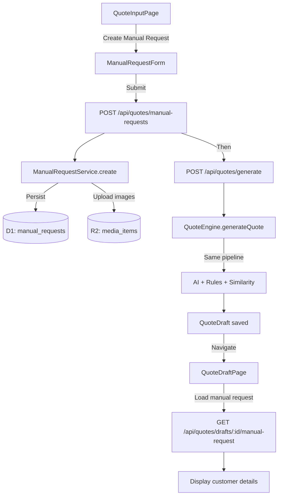

# Design Document: Manual Request Creation

## Overview

This feature adds a manual request creation flow to the Quote Generation Engine, allowing business users to create customer requests directly in the app without relying on Jobber. The manual request captures structured customer details (name, phone, email, address) and a free-text service description, then feeds them into the existing AI-powered quote generation pipeline.

The design extends the existing `QuoteInputPage` with a new form mode, adds a `manual_requests` table to D1, introduces a `ManualRequestService` on the worker, and updates the `QuoteDraftPage` to display customer details when a draft originates from a manual request.

## Architecture



The flow is a two-step process from the client's perspective:
1. **Create the manual request** — persists customer details and returns a `manualRequestId`
2. **Generate the quote** — calls the existing `/generate` endpoint with the service description text, image IDs, and the new `manualRequestId`

This keeps the quote generation pipeline unchanged and simply adds a new source of customer request data.

## Components and Interfaces

### New Shared Types (`shared/src/types/quote.ts`)

```typescript
/** A manually-created customer request */
export interface ManualRequest {
  id: string;
  userId: string;
  customerName: string;
  customerPhone: string | null;
  customerEmail: string | null;
  customerAddress: string | null;
  serviceDescription: string;
  mediaItemIds: string[];
  requestSource: 'manual';
  createdAt: Date;
}

/** Payload for creating a manual request */
export interface CreateManualRequestPayload {
  customerName: string;
  customerPhone?: string;
  customerEmail?: string;
  customerAddress?: string;
  serviceDescription: string;
  mediaItemIds?: string[];
}
```

### New Service: `ManualRequestService` (`worker/src/services/manual-request-service.ts`)

```typescript
export class ManualRequestService {
  constructor(private readonly db: D1Database) {}

  /** Create and persist a manual request. Returns the saved record. */
  async create(userId: string, payload: CreateManualRequestPayload): Promise<ManualRequest>;

  /** Get a manual request by ID, scoped to user. */
  async getById(id: string, userId: string): Promise<ManualRequest>;

  /** Get a manual request by its associated quote draft ID. */
  async getByDraftId(draftId: string, userId: string): Promise<ManualRequest | null>;
}
```

### New API Routes (`worker/src/routes/quotes.ts`)

| Method | Path | Description |
|--------|------|-------------|
| `POST` | `/api/quotes/manual-requests` | Create a manual request |
| `GET` | `/api/quotes/manual-requests/:id` | Get a manual request by ID |
| `GET` | `/api/quotes/drafts/:id/manual-request` | Get the manual request associated with a draft |

### Updated Client API (`client/src/api.ts`)

```typescript
export async function createManualRequest(
  payload: CreateManualRequestPayload
): Promise<ManualRequest>;

export async function fetchManualRequest(id: string): Promise<ManualRequest>;

export async function fetchDraftManualRequest(
  draftId: string
): Promise<ManualRequest | null>;
```

### Updated Client Components

- **`QuoteInputPage.tsx`** — Add "Create Manual Request" button/mode that shows the `ManualRequestForm`
- **`ManualRequestForm.tsx`** (new) — Form component with customer details, service description, and image upload
- **`QuoteDraftPage.tsx`** — Add customer details panel when draft has an associated manual request

### Updated QuoteDraft Type

The existing `QuoteDraft` interface gains a new optional field:

```typescript
export interface QuoteDraft {
  // ... existing fields ...
  manualRequestId?: string | null;
  clientName?: string | null; // already exists, will be populated from manual request
}
```

## Data Models

### New Table: `manual_requests`

Migration file: `worker/src/migrations/0027_manual_requests.sql`

```sql
CREATE TABLE IF NOT EXISTS manual_requests (
    id TEXT PRIMARY KEY,
    user_id TEXT NOT NULL REFERENCES users(id) ON DELETE CASCADE,
    customer_name TEXT NOT NULL,
    customer_phone TEXT,
    customer_email TEXT,
    customer_address TEXT,
    service_description TEXT NOT NULL,
    media_item_ids_json TEXT NOT NULL DEFAULT '[]',
    created_at TEXT NOT NULL DEFAULT (datetime('now'))
);
CREATE INDEX IF NOT EXISTS idx_manual_requests_user_id ON manual_requests(user_id);

-- IDEMPOTENCY: column may already exist; deploy will apply manually if needed
ALTER TABLE quote_drafts ADD COLUMN manual_request_id TEXT REFERENCES manual_requests(id);
CREATE INDEX IF NOT EXISTS idx_quote_drafts_manual_request_id ON quote_drafts(manual_request_id);
```

### Data Flow

1. User fills out `ManualRequestForm` → client calls `POST /api/quotes/manual-requests`
2. Server validates input, persists to `manual_requests` table, returns the record
3. Client calls `POST /api/quotes/generate` with `{ customerText: serviceDescription, mediaItemIds, manualRequestId }`
4. Server's `/generate` handler stores `manualRequestId` on the draft (alongside existing `jobberRequestId`)
5. `QuoteDraftService.save()` persists the `manual_request_id` column
6. When loading a draft, if `manual_request_id` is set, the client fetches the manual request details for display

### Validation Rules

| Field | Rule |
|-------|------|
| `customerName` | Required, non-empty after trim, max 200 chars |
| `customerPhone` | Optional, max 30 chars |
| `customerEmail` | Optional, must match basic email regex if provided |
| `customerAddress` | Optional, max 500 chars |
| `serviceDescription` | Required, non-empty after trim, max 10000 chars, min 1 char |
| `mediaItemIds` | Optional array, max 10 items |


## Correctness Properties

*A property is a characteristic or behavior that should hold true across all valid executions of a system — essentially, a formal statement about what the system should do. Properties serve as the bridge between human-readable specifications and machine-verifiable correctness guarantees.*

### Property 1: Required field whitespace rejection

*For any* string composed entirely of whitespace characters (spaces, tabs, newlines), submitting it as the `customerName` or `serviceDescription` field SHALL be rejected by the validation logic, and the request SHALL not be persisted.

**Validates: Requirements 2.3, 3.2**

### Property 2: Email format validation

*For any* string provided as `customerEmail`, the validation function SHALL accept it if and only if it matches a valid email format (contains exactly one `@`, has a non-empty local part, and has a domain with at least one dot). Invalid emails SHALL cause the request to be rejected.

**Validates: Requirements 2.4**

### Property 3: File type validation with error identification

*For any* file with a MIME type not in the set {`image/jpeg`, `image/png`, `image/heic`, `image/webp`}, the upload validator SHALL reject the file AND the error message SHALL contain the original filename.

**Validates: Requirements 4.1, 4.3**

### Property 4: Customer name propagation to draft

*For any* valid manual request with a non-empty customer name, when a quote draft is generated from that request, the resulting `QuoteDraft.clientName` field SHALL equal the `customerName` from the manual request.

**Validates: Requirements 5.2**

### Property 5: Manual request source invariant

*For any* quote draft generated from a manual request (i.e., where `manualRequestId` is non-null), the draft's `manualRequestId` SHALL reference a valid `manual_requests` record, and the request's `requestSource` SHALL always be `"manual"`.

**Validates: Requirements 5.3**

### Property 6: Customer details persistence round-trip

*For any* valid combination of customer details (name, phone, email, address, service description), persisting a manual request and then reading it back SHALL produce an identical record — all fields SHALL be preserved without modification.

**Validates: Requirements 6.1**

### Property 7: Manual request ↔ draft association

*For any* quote draft generated from a manual request, querying the manual request by the draft's `manualRequestId` SHALL return the original request, and querying the draft by the manual request's ID SHALL return the associated draft.

**Validates: Requirements 6.2**

## Error Handling

| Scenario | Error Type | Severity | Recommended Action |
|----------|-----------|----------|-------------------|
| Empty customer name | `PlatformError` | `error` | "Enter a customer name" |
| Empty service description | `PlatformError` | `error` | "Enter a service description" |
| Invalid email format | `PlatformError` | `error` | "Enter a valid email address" |
| Customer name exceeds 200 chars | `PlatformError` | `error` | "Customer name must be 200 characters or less" |
| Service description exceeds 10000 chars | `PlatformError` | `error` | "Service description must be 10,000 characters or less" |
| Image limit exceeded (>10) | `PlatformError` | `error` | "Maximum 10 images allowed" |
| Unsupported file type | `PlatformError` | `error` | "File '{filename}' is not a supported format. Use JPEG, PNG, HEIC, or WebP" |
| Database write failure | `PlatformError` | `error` | "Failed to save request. Please try again" |
| Manual request not found | `PlatformError` | `error` | "Manual request not found" |

All errors follow the existing `PlatformError` pattern with `severity`, `component`, `operation`, `description`, and `recommendedActions` fields. Client-side validation mirrors server-side validation to provide immediate feedback.

## Testing Strategy

### Property-Based Tests (fast-check, minimum 100 iterations each)

Property-based testing is appropriate for this feature because the validation logic and data persistence layer have clear input/output behavior and a large input space (arbitrary strings, email formats, MIME types).

**Library:** `fast-check` (already used in the project)

Each property test will:
- Run a minimum of 100 iterations
- Be tagged with a comment referencing the design property
- Tag format: `Feature: manual-request-creation, Property {number}: {property_text}`

Tests to implement:
1. **Property 1** — Generate whitespace-only strings, verify validation rejects them for both `customerName` and `serviceDescription`
2. **Property 2** — Generate random strings, verify email validator correctly classifies valid vs invalid emails
3. **Property 3** — Generate random MIME types and filenames, verify rejection of non-allowed types and error message content
4. **Property 4** — Generate random customer names, create manual requests (with mocked DB), verify `clientName` on resulting draft matches
5. **Property 5** — Generate random manual request payloads, verify `requestSource` is always `"manual"`
6. **Property 6** — Generate random customer details, persist and read back (mocked D1), verify round-trip equality
7. **Property 7** — Generate random manual requests, create drafts, verify bidirectional association

### Unit Tests (example-based)

- Form rendering: verify all fields present with correct attributes
- Form interaction: "Create Manual Request" button shows the form
- Jobber unavailable: manual form shown as primary
- Session persistence: form data preserved on navigation
- Boundary: 5000+ character service description accepted
- Error display: DB failure returns structured PlatformError with retry action
- Legacy draft display: no customer details panel when no request association
- Jobber draft display: Jobber link still shown for Jobber-sourced drafts

### Integration Tests

- End-to-end: submit manual request → generate quote → verify draft has correct data
- Same pipeline: verify catalog, rules engine, and similarity engine are invoked for manual requests
