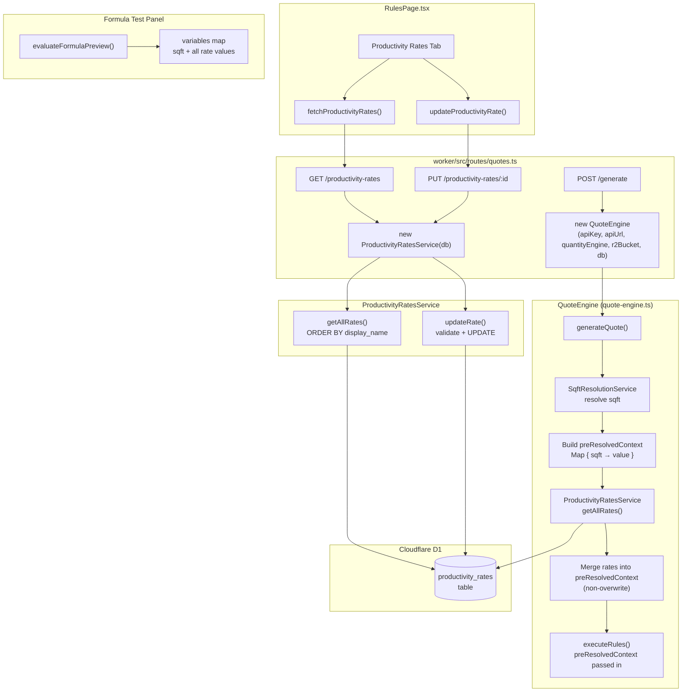
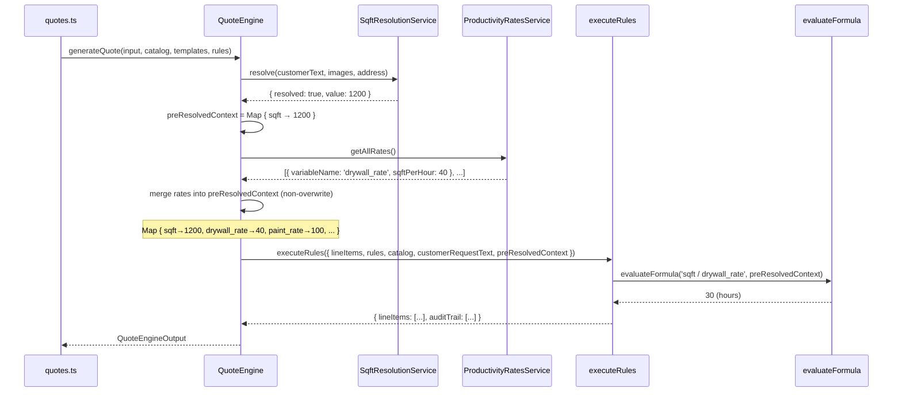

# Design Document: Productivity Rates

## Overview

The productivity rates feature adds a global lookup table of sqft-per-hour values that the rules engine can use in `compute_quantity` formulas. Today, a formula like `sqft / drywall_rate` fails because `drywall_rate` is an unresolved variable. After this feature, the `QuoteEngine` loads all rates from D1 and injects them into `preResolvedContext` alongside `sqft` before calling `executeRules()`, making every rate variable available to every formula.

The system is intentionally minimal for v1: rates are global (not per-user), the initial set is seeded by migration, and the UI only edits existing rates — no creation or deletion. This matches the single-business-entity model of Chicago Reno.

### Key Design Decisions

**Global rates, not per-user.** Chicago Reno operates as one business. Labor efficiency is a property of the crew, not the customer. Location-based pricing differences affect unit prices (already per-catalog-entry), not labor hours.

**Injection into `preResolvedContext`, not the formula evaluator.** The formula evaluator already accepts a `Map<string, number>` of variables. Injecting rates into `preResolvedContext` before `executeRules()` is the minimal, non-invasive integration point — no changes to the formula evaluator or rules engine are needed.

**Non-overwrite merge.** If `preResolvedContext` already contains a key that matches a rate's `variable_name`, the existing value wins. This preserves the principle that explicitly pre-resolved context (e.g., `sqft` from the resolution pipeline) is authoritative.

**QuoteEngine needs a `db` reference.** Currently `QuoteEngine` has no D1 binding — it receives data from the route handler. To load rates, the constructor must accept an optional `D1Database` parameter. The route handler already has `c.env.DB` and passes it to other services. Making it optional preserves backward compatibility with existing tests.

---

## Architecture



### Data Flow: Quote Generation with Rates



---

## Components and Interfaces

### ProductivityRatesService

```typescript
// worker/src/services/productivity-rates-service.ts

import { PlatformError } from '../errors/index.js';
import type { ProductivityRate, UpdateProductivityRatePayload } from 'shared';

const RESERVED_VARIABLE_NAMES = new Set(['sqft']);
const VARIABLE_NAME_PATTERN = /^[a-z][a-z0-9_]*$/;

export class ProductivityRatesService {
  private readonly db: D1Database;

  constructor(db: D1Database) {
    this.db = db;
  }

  /** Return all rates ordered by display_name ascending. */
  async getAllRates(): Promise<ProductivityRate[]>;

  /** Return a single rate by id, or throw 404 PlatformError. */
  async getRateById(id: string): Promise<ProductivityRate>;

  /**
   * Update sqft_per_hour, display_name, and/or description for an existing rate.
   * Validates sqft_per_hour is a finite positive number.
   * Returns the updated rate.
   */
  async updateRate(id: string, payload: UpdateProductivityRatePayload): Promise<ProductivityRate>;

  /** Map a raw D1 row to a ProductivityRate. */
  private mapRow(row: Record<string, unknown>): ProductivityRate;

  /** Validate sqft_per_hour is a finite positive number. */
  private validateSqftPerHour(value: number): void;
}
```

**Validation rules enforced by the service:**

| Field | Rule | Error |
|---|---|---|
| `sqft_per_hour` | `Number.isFinite(v) && v > 0` | 400 — must be finite positive |
| `display_name` | Non-empty after trim | 400 — must be non-empty |

Note: `variable_name` is set at seed time by migration and is not editable via the v1 API. The uniqueness constraint and pattern enforcement are enforced at the database level (UNIQUE constraint) and are not needed in the service's update path.

### QuoteEngine Changes

The constructor gains an optional `db` parameter:

```typescript
// worker/src/services/quote-engine.ts (modified constructor)

export class QuoteEngine {
  private readonly apiKey: string;
  private readonly apiUrl: string;
  private readonly quantityEngine?: QuantityEngine;
  private readonly r2Bucket?: R2Bucket;
  private readonly db?: D1Database;  // NEW — optional for backward compat

  constructor(
    apiKey: string,
    apiUrl: string,
    quantityEngine?: QuantityEngine,
    r2Bucket?: R2Bucket,
    db?: D1Database,  // NEW
  ) { ... }
}
```

The injection block in `generateQuote`, inserted after sqft resolution builds `preResolvedContext` and before `executeRules`:

```typescript
// After sqft resolution block...

// NEW: inject productivity rates into preResolvedContext
if (this.db) {
  try {
    const productivityRatesService = new ProductivityRatesService(this.db);
    const rates = await productivityRatesService.getAllRates();
    for (const rate of rates) {
      if (!preResolvedContext) preResolvedContext = new Map();
      // Non-overwrite: existing values (e.g. sqft) take precedence
      if (!preResolvedContext.has(rate.variableName)) {
        preResolvedContext.set(rate.variableName, rate.sqftPerHour);
      }
    }
  } catch {
    // Graceful degradation — rate loading failure must not block quote generation
  }
}
```

### Route Handler Changes

Two new endpoints added to `worker/src/routes/quotes.ts`:

```typescript
/**
 * GET /productivity-rates
 * Return all productivity rates ordered by display_name ascending.
 */
app.get('/productivity-rates', async (c) => {
  const service = new ProductivityRatesService(c.env.DB);
  const rates = await service.getAllRates();
  return c.json({ rates });
});

/**
 * PUT /productivity-rates/:id
 * Update sqft_per_hour, display_name, and/or description for a rate.
 */
app.put('/productivity-rates/:id', async (c) => {
  const service = new ProductivityRatesService(c.env.DB);
  const body = await c.req.json() as UpdateProductivityRatePayload;
  const rate = await service.updateRate(c.req.param('id'), body);
  return c.json(rate);
});
```

The `POST /generate` route instantiation changes to pass `c.env.DB`:

```typescript
// Before:
const quoteEngine = new QuoteEngine(
  c.env.AI_TEXT_API_KEY, c.env.AI_TEXT_API_URL, new QuantityEngine(db), c.env.R2_BUCKET
);

// After:
const quoteEngine = new QuoteEngine(
  c.env.AI_TEXT_API_KEY, c.env.AI_TEXT_API_URL, new QuantityEngine(db), c.env.R2_BUCKET, db
);
```

### Client API Functions

```typescript
// client/src/api.ts (additions)

export async function fetchProductivityRates(): Promise<ProductivityRate[]> {
  const res = await fetch(API_BASE + '/api/quotes/productivity-rates', {
    headers: { ...authHeaders() },
  });
  const data = await handleResponse<{ rates: ProductivityRate[] }>(res);
  return data.rates;
}

export async function updateProductivityRate(
  id: string,
  payload: UpdateProductivityRatePayload,
): Promise<ProductivityRate> {
  const res = await fetch(API_BASE + '/api/quotes/productivity-rates/' + id, {
    method: 'PUT',
    headers: { 'Content-Type': 'application/json', ...authHeaders() },
    body: JSON.stringify(payload),
  });
  return handleResponseWithToast(res);
}
```

### RulesPage Changes

The `TabId` union type gains a new member:

```typescript
type TabId = 'rules' | 'ordering' | 'rates';  // 'rates' is new
```

A new `ProductivityRatesTab` component is added alongside `BusinessRulesTab` and `ProductOrderingTab`. The tab bar gains a third "Productivity Rates" button.

The formula test panel in `BusinessRulesTab` is updated to accept a `rates` prop (loaded once when the tab mounts) and merge rate values into the `variables` map before calling `evaluateFormulaPreview`:

```typescript
// In runFormulaTest(), after building variables from extractions:
// Merge productivity rates so formulas like sqft / drywall_rate work
for (const rate of rates) {
  if (!(rate.variableName in variables)) {
    variables[rate.variableName] = rate.sqftPerHour;
  }
}
```

---

## Data Models

### Database Schema

```sql
-- worker/src/migrations/0030_productivity_rates.sql
-- Creates the global productivity_rates table and seeds 6 initial rates.
-- Rates represent sqft-per-hour values for trade-specific labor categories.

CREATE TABLE IF NOT EXISTS productivity_rates (
  id            TEXT PRIMARY KEY,
  variable_name TEXT NOT NULL UNIQUE,
  display_name  TEXT NOT NULL,
  sqft_per_hour REAL NOT NULL,
  description   TEXT,
  created_at    TEXT NOT NULL DEFAULT (datetime('now')),
  updated_at    TEXT NOT NULL DEFAULT (datetime('now'))
);

CREATE INDEX IF NOT EXISTS idx_productivity_rates_variable_name
  ON productivity_rates(variable_name);

-- Seed initial rates using INSERT OR IGNORE for idempotency.
-- Flooring items (quantity = sqft * 1) are intentionally excluded —
-- their compute_quantity formula does not require a rate variable.
INSERT OR IGNORE INTO productivity_rates (id, variable_name, display_name, sqft_per_hour, description)
VALUES
  ('pr-drywall',
   'drywall_rate',
   'Drywall: Installation of New Drywall',
   40,
   'Square feet of new drywall a crew can install per hour'),
  ('pr-paint',
   'paint_rate',
   'Interior Painting',
   100,
   'Square feet of interior wall a crew can paint per hour'),
  ('pr-paint-ceiling',
   'paint_ceiling_rate',
   'Interior Painting: Ceilings',
   80,
   'Square feet of ceiling a crew can paint per hour'),
  ('pr-tile-shower',
   'tile_shower_rate',
   'Tile: Install Tiled Shower Surround',
   8,
   'Square feet of shower surround tile a crew can install per hour'),
  ('pr-tile-floor',
   'tile_floor_rate',
   'Tile: Install and Grout New Tile Floor',
   12,
   'Square feet of floor tile a crew can install and grout per hour'),
  ('pr-tile-bath',
   'tile_bath_rate',
   'Tile: Bath Surround',
   8,
   'Square feet of bath surround tile a crew can install per hour');
```

### Shared TypeScript Types

```typescript
// shared/src/types/quote.ts (additions at end of file)

/** A global productivity rate used in compute_quantity formulas */
export interface ProductivityRate {
  id: string;
  variableName: string;
  displayName: string;
  sqftPerHour: number;
  description: string | null;
  createdAt: Date;
  updatedAt: Date;
}

/** Payload for updating a productivity rate */
export interface UpdateProductivityRatePayload {
  sqftPerHour: number;
  displayName?: string;
  description?: string;
}
```

### D1 Row → TypeScript Mapping

| D1 column | TypeScript field | Conversion |
|---|---|---|
| `id` | `id` | direct |
| `variable_name` | `variableName` | direct |
| `display_name` | `displayName` | direct |
| `sqft_per_hour` | `sqftPerHour` | `Number(row.sqft_per_hour)` |
| `description` | `description` | `row.description ?? null` |
| `created_at` | `createdAt` | `new Date(row.created_at as string)` |
| `updated_at` | `updatedAt` | `new Date(row.updated_at as string)` |

### API Request/Response Shapes

**GET /api/quotes/productivity-rates**

Response `200 OK`:
```json
{
  "rates": [
    {
      "id": "pr-drywall",
      "variableName": "drywall_rate",
      "displayName": "Drywall: Installation of New Drywall",
      "sqftPerHour": 40,
      "description": "Square feet of new drywall a crew can install per hour",
      "createdAt": "2025-01-01T00:00:00.000Z",
      "updatedAt": "2025-01-01T00:00:00.000Z"
    }
  ]
}
```

**PUT /api/quotes/productivity-rates/:id**

Request body:
```json
{
  "sqftPerHour": 45,
  "displayName": "Drywall: Installation of New Drywall",
  "description": "Updated description"
}
```

Response `200 OK`: the updated `ProductivityRate` object (same shape as array element above).

Response `400 Bad Request` (invalid value):
```json
{
  "severity": "error",
  "component": "ProductivityRatesService",
  "operation": "updateRate",
  "description": "sqft_per_hour must be a finite positive number greater than zero.",
  "recommendedActions": ["Enter a positive number such as 40"]
}
```

Response `404 Not Found` (unknown id):
```json
{
  "severity": "error",
  "component": "ProductivityRatesService",
  "operation": "getRateById",
  "description": "Productivity rate with id \"xyz\" not found.",
  "recommendedActions": ["Refresh the page to reload the current rates"]
}
```

---

## Correctness Properties

*A property is a characteristic or behavior that should hold true across all valid executions of a system — essentially, a formal statement about what the system should do. Properties serve as the bridge between human-readable specifications and machine-verifiable correctness guarantees.*

### Property 1: sqft_per_hour validation accepts exactly finite positive numbers

*For any* number (including `NaN`, `Infinity`, `-Infinity`, `0`, negative values, and positive values), the `ProductivityRatesService` sqft_per_hour validator SHALL accept it if and only if `Number.isFinite(value) && value > 0`.

**Validates: Requirements 1.3, 4.3**

### Property 2: Rate injection is complete and non-overwriting

*For any* set of valid productivity rates and any initial `preResolvedContext` map, after the `QuoteEngine` injects rates into the context:
- Every rate's `variableName` is present in the resulting map
- Every rate's `variableName` that was NOT already in the map maps to the rate's `sqftPerHour` value
- Every key that WAS already in the map retains its original value

**Validates: Requirements 3.1, 3.3**

### Property 3: Formula evaluation with injected rate variables produces correct arithmetic

*For any* finite positive `sqft` value and any finite positive rate value, evaluating the formula `sqft / rate_variable` with a context map containing both variables SHALL return `sqft / rate_value` (within floating-point precision).

**Validates: Requirements 3.2**

### Property 4: GET endpoint returns rates sorted by display_name ascending

*For any* set of productivity rates stored in D1, the `getAllRates()` method SHALL return them in ascending lexicographic order by `display_name`.

**Validates: Requirements 4.1**

### Property 5: Update round-trip preserves written values

*For any* valid `UpdateProductivityRatePayload` applied to an existing rate, fetching that rate after the update SHALL return an object where `sqftPerHour`, `displayName` (if provided), and `description` (if provided) match the payload values.

**Validates: Requirements 4.2**

### Property 6: D1 row serialization maps all fields correctly

*For any* valid productivity rate row stored in D1, the `mapRow` function SHALL produce a `ProductivityRate` object where every camelCase field contains the value from the corresponding snake_case column, with `createdAt` and `updatedAt` as valid `Date` objects.

**Validates: Requirements 7.3**

### Property 7: Formula test panel variables include all loaded rates

*For any* set of loaded `ProductivityRate` objects, the variables map passed to `evaluateFormulaPreview` in the formula test panel SHALL contain an entry for every rate's `variableName` with the rate's `sqftPerHour` as the value.

**Validates: Requirements 6.1, 6.2**

---

## Error Handling

| Scenario | Component | Severity | HTTP Status | Description |
|---|---|---|---|---|
| `sqft_per_hour` is not finite positive | `ProductivityRatesService.validateSqftPerHour` | `error` | 400 | "sqft_per_hour must be a finite positive number greater than zero." |
| `display_name` is empty after trim | `ProductivityRatesService.updateRate` | `error` | 400 | "display_name must be a non-empty string." |
| Rate id not found on PUT | `ProductivityRatesService.getRateById` | `error` | 404 | "Productivity rate with id \"…\" not found." |
| D1 query fails during rate loading in QuoteEngine | `QuoteEngine.generateQuote` | — | — | Silently caught; quote generation proceeds without rates (graceful degradation — no error surfaced to user) |
| D1 query fails on GET /productivity-rates | `ProductivityRatesService.getAllRates` | `error` | 500 | Propagated as PlatformError by the global error handler middleware |
| Formula references unknown rate variable | `evaluateFormula` / `evaluateFormulaPreview` | warning (UI) | — | "Variable 'unknown_rate' not found in extracted values" — displayed inline in formula test panel |
| Rate Editor API call fails on save | `ProductivityRatesTab` | warning (UI) | — | Error message from API displayed inline; unsaved edits preserved in component state |
| Rate Editor fails to load on mount | `ProductivityRatesTab` | warning (UI) | — | Error message displayed with a retry button |

### Graceful Degradation in QuoteEngine

Rate loading is wrapped in a `try/catch` with no re-throw. This mirrors the existing pattern for sqft resolution and quantity prediction. The consequence of failure is that `compute_quantity` formulas referencing rate variables will fail at formula evaluation time (missing variable), which the rules engine already handles gracefully by skipping the action and recording a warning in the audit trail.

---

## Testing Strategy

### Unit Tests

**`tests/unit/productivity-rates-service.test.ts`**

- `getAllRates()` returns empty array when table is empty
- `getAllRates()` returns rates ordered by `display_name` ascending
- `updateRate()` updates `sqft_per_hour` and `updated_at`
- `updateRate()` updates optional `display_name` and `description` when provided
- `updateRate()` throws 404 PlatformError for unknown id
- `updateRate()` throws 400 PlatformError for non-finite `sqft_per_hour`
- `updateRate()` throws 400 PlatformError for zero `sqft_per_hour`
- `updateRate()` throws 400 PlatformError for negative `sqft_per_hour`
- `updateRate()` throws 400 PlatformError for empty `display_name`
- `mapRow()` correctly maps all snake_case columns to camelCase fields with correct types

**Quote engine rate injection** (added to existing quote engine tests or a new file):

- Rates are injected into `preResolvedContext` when `db` is provided
- Existing `preResolvedContext` values are not overwritten by rates with the same key
- Rate loading failure does not throw — quote generation proceeds normally
- Empty rates table results in no additional context entries beyond `sqft`

### Property-Based Tests

**`tests/property/productivity-rates.property.test.ts`**

Uses **fast-check** (already in the project). Minimum 100 iterations per property.

```typescript
// Feature: productivity-rates, Property 1: sqft_per_hour validation
// For any number, validator accepts iff finite and > 0
fc.assert(fc.property(
  fc.oneof(fc.float(), fc.integer(), fc.constant(NaN), fc.constant(Infinity), fc.constant(-Infinity)),
  (v) => {
    const isValid = Number.isFinite(v) && v > 0;
    // assert: validateSqftPerHour(v) throws iff !isValid
  }
), { numRuns: 1000 });

// Feature: productivity-rates, Property 2: rate injection completeness and non-overwrite
// For any set of rates and any initial context, injection is complete and non-overwriting
fc.assert(fc.property(
  fc.array(arbitraryRate()),
  fc.dictionary(fc.string(), fc.float({ min: 0.01 })),
  (rates, initial) => {
    const context = new Map(Object.entries(initial));
    injectRates(context, rates);
    for (const rate of rates) {
      expect(context.has(rate.variableName)).toBe(true);
      if (rate.variableName in initial) {
        expect(context.get(rate.variableName)).toBe(initial[rate.variableName]);
      } else {
        expect(context.get(rate.variableName)).toBe(rate.sqftPerHour);
      }
    }
  }
), { numRuns: 200 });

// Feature: productivity-rates, Property 3: formula evaluation with rate variables
// For any positive sqft and positive rate, sqft / rate_var = sqft / rate_value
fc.assert(fc.property(
  fc.float({ min: 0.01, max: 100000, noNaN: true }),
  fc.float({ min: 0.01, max: 10000, noNaN: true }),
  (sqft, rate) => {
    const vars = new Map([['sqft', sqft], ['drywall_rate', rate]]);
    const result = evaluateFormula('sqft / drywall_rate', vars);
    expect(result).toBeCloseTo(sqft / rate, 5);
  }
), { numRuns: 500 });

// Feature: productivity-rates, Property 6: D1 row serialization
// For any valid rate row, mapRow produces correct camelCase fields
fc.assert(fc.property(
  arbitraryRateRow(),
  (row) => {
    const rate = mapRow(row);
    expect(rate.variableName).toBe(row.variable_name);
    expect(rate.displayName).toBe(row.display_name);
    expect(rate.sqftPerHour).toBe(Number(row.sqft_per_hour));
    expect(rate.description).toBe(row.description ?? null);
    expect(rate.createdAt).toBeInstanceOf(Date);
    expect(rate.updatedAt).toBeInstanceOf(Date);
  }
), { numRuns: 200 });

// Feature: productivity-rates, Property 7: formula test panel variables include all rates
// For any set of rates, all variableNames appear in the evaluator's variable map
fc.assert(fc.property(
  fc.array(arbitraryRate()),
  (rates) => {
    const variables = buildFormulaTestVariables({}, rates);
    for (const rate of rates) {
      expect(variables[rate.variableName]).toBe(rate.sqftPerHour);
    }
  }
), { numRuns: 200 });
```

**Properties 4 (GET ordering) and 5 (update round-trip)** require a D1 instance. They are covered by the unit tests for `getAllRates()` ordering and `updateRate()` round-trip behavior using the mock D1 helper in `tests/unit/helpers/mock-d1.ts`.

### Integration Tests

- `GET /api/quotes/productivity-rates` returns 200 with all seeded rates after migration
- `PUT /api/quotes/productivity-rates/:id` returns 200 with updated rate
- `PUT /api/quotes/productivity-rates/:id` returns 400 for invalid `sqft_per_hour`
- `PUT /api/quotes/productivity-rates/:id` returns 404 for unknown id
- Unauthenticated requests to both endpoints return 401

### Manual Smoke Tests

- After deploying migration 0030, verify 6 seeded rates appear in the Rate Editor tab
- Write a `compute_quantity` rule with formula `sqft / drywall_rate`, generate a quote with resolved sqft, verify the line item quantity equals `sqft / 40`
- Edit `drywall_rate` to 50 in the Rate Editor, regenerate the quote, verify quantity updates to `sqft / 50`
- In the formula test panel, type `sqft / drywall_rate` with sqft extracted from request text, verify the preview shows the correct computed result
- Verify that referencing an unknown variable (e.g., `sqft / unknown_rate`) in the formula test panel shows a clear error identifying `unknown_rate` as missing
