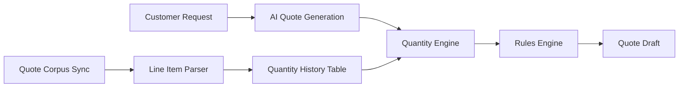
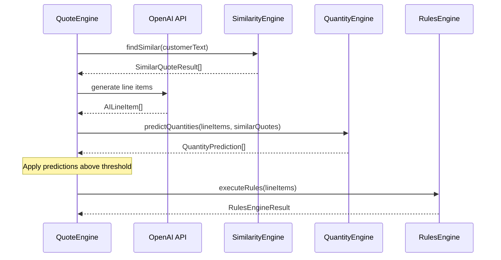
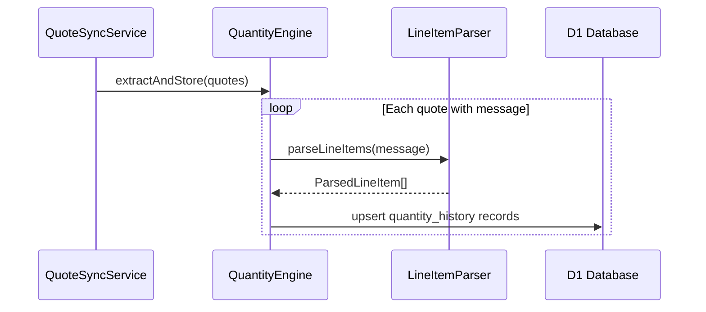

# Design Document: Quantity Engine

## Overview

The Quantity Engine is a new service that predicts line item quantities for quote generation by analyzing historical quote data. It sits between the AI quote generation step and the rules engine in the quote generation pipeline, providing statistically-informed quantity predictions that improve upon the AI's default estimates (which often default to 1).

The system works by:
1. Extracting product-quantity pairs from historical quote messages during corpus sync
2. Storing these associations in a `quantity_history` table for fast lookup
3. At quote generation time, finding matching products in similar quotes and computing a similarity-weighted prediction with a confidence score
4. Applying predictions that exceed a confidence threshold, while allowing the rules engine to override them



## Architecture

### Pipeline Integration

The Quantity Engine integrates into the existing quote generation flow in `QuoteEngine.generateQuote()`:



### Data Flow for Extraction

During quote corpus sync, the `QuoteSyncService` calls into the `QuantityEngine` to extract and store quantity data:



### Design Decisions

1. **Separate parser module**: The line item parser is a pure function module (`line-item-parser.ts`) rather than a method on the service class. This enables direct property-based testing without mocking and keeps the parsing logic reusable.

2. **Weighted median over weighted mean**: The prediction uses a similarity-weighted median rather than a mean. Medians are robust to outliers — a single unusual quote won't skew predictions dramatically.

3. **Confidence threshold gating**: Predictions below the threshold are silently discarded rather than surfaced with warnings. This keeps the UX clean — users only see predictions the system is confident about.

4. **Rules engine always wins**: The rules engine executes after quantity predictions, so business rules can always override historical patterns. This preserves the existing mental model where rules are authoritative.

5. **Extraction during sync, not on-demand**: Quantity data is pre-extracted during corpus sync rather than parsed on every quote generation request. This keeps prediction latency low and avoids repeated parsing of the same messages.

## Components and Interfaces

### QuantityEngine Service

```typescript
// worker/src/services/quantity-engine.ts

export interface QuantityPrediction {
  productName: string;
  predictedQuantity: number;
  confidenceScore: number;          // 0-100
  sourceQuotes: SourceQuoteRef[];
  dataPointCount: number;
}

export interface SourceQuoteRef {
  quoteNumber: string;
  quantity: number;
  similarityScore: number;
}

export interface QuantityEngineConfig {
  confidenceThreshold: number;  // default: 50
}

export type QuantitySource = 'ai_estimate' | 'historical_prediction' | 'rule_override';

export class QuantityEngine {
  constructor(db: D1Database, config?: Partial<QuantityEngineConfig>);

  /**
   * Predict quantities for line items based on historical data from similar quotes.
   * Returns predictions only for products with sufficient historical data.
   * Returns empty array on any error (graceful degradation).
   */
  async predictQuantities(
    lineItems: EngineLineItem[],
    similarQuotes: SimilarQuoteResult[],
  ): Promise<QuantityPrediction[]>;

  /**
   * Extract line items from historical quote messages and store in quantity_history.
   * Called during quote corpus sync. Skips unparseable quotes without error.
   */
  async extractAndStore(
    quotes: Array<{ jobberQuoteId: string; quoteNumber: string; message: string | null }>
  ): Promise<{ extracted: number; skipped: number }>;
}
```

### LineItemParser

A pure function module for parsing line items from historical quote message text:

```typescript
// worker/src/services/line-item-parser.ts

export interface ParsedLineItem {
  productName: string;
  quantity: number;
  unitPrice?: number;
}

/**
 * Parse line items from a quote message string.
 * Supports multiple formats:
 * - "ProductName — Quantity x UnitPrice" (em-dash format from Jobber)
 * - "ProductName\tQuantity\tUnitPrice" (tab-separated)
 * - "ProductName, Quantity, UnitPrice" (comma-separated)
 * 
 * Returns empty array for unparseable input. Never throws.
 */
export function parseLineItems(message: string): ParsedLineItem[];

/**
 * Format parsed line items into canonical string representation.
 * Uses the "ProductName — Quantity x UnitPrice" format.
 * Each line item is separated by a newline.
 */
export function printLineItems(items: ParsedLineItem[]): string;
```

### Confidence Scoring (internal)

```typescript
// Internal to QuantityEngine — exported for testing

export interface ConfidenceInput {
  sampleSize: number;
  coefficientOfVariation: number;
}

/**
 * Compute confidence score based on sample size and variance.
 * 
 * Algorithm:
 * 1. Base score from sample size: min(100, sampleSize * 10)
 * 2. Apply sample-size caps:
 *    - sampleSize < 2: return 0
 *    - sampleSize < 5: cap at 60
 * 3. Apply variance penalty:
 *    - CV > 0.5: subtract max(30, CV * 40) from base
 *    - CV 0.3-0.5: subtract CV * 20 from base
 * 4. Clamp to [0, 100]
 * 
 * Returns integer in [0, 100].
 */
export function computeConfidence(input: ConfidenceInput): number;
```

### Weighted Median Computation (internal)

```typescript
// Internal to QuantityEngine — exported for testing

/**
 * Compute similarity-weighted median of quantity values.
 * Each quantity is weighted by its source quote's similarity score.
 * 
 * Algorithm:
 * 1. Sort (quantity, weight) pairs by quantity ascending
 * 2. Compute cumulative weight
 * 3. Find the quantity where cumulative weight reaches 50% of total weight
 * 4. If the 50% mark falls exactly between two quantities, take the lower
 * 
 * Precondition: dataPoints is non-empty, all weights > 0, all quantities > 0
 */
export function weightedMedian(
  dataPoints: Array<{ quantity: number; weight: number }>
): number;
```

### Integration with QuoteEngine

The `QuoteEngine.generateQuote()` method gains a new optional parameter and internal step:

```typescript
// In QuoteEngine.generateQuote():
// After AI response parsing, before rules engine execution:

if (quantityEngine && similarQuotes.length > 0) {
  const predictions = await quantityEngine.predictQuantities(engineLineItems, similarQuotes);
  
  for (const prediction of predictions) {
    if (prediction.confidenceScore > config.confidenceThreshold) {
      const lineItem = engineLineItems.find(
        li => matchesProductName(li.productName, prediction.productName, 'starts_with')
      );
      if (lineItem) {
        lineItem.quantity = prediction.predictedQuantity;
        // Store prediction metadata for traceability
        lineItem.quantityPrediction = {
          predictedQuantity: prediction.predictedQuantity,
          confidenceScore: prediction.confidenceScore,
          sourceQuoteNumbers: prediction.sourceQuotes.map(sq => sq.quoteNumber),
          quantitySource: 'historical_prediction',
        };
      }
    }
  }
}
```

### Integration with QuoteSyncService

The `QuoteSyncService.sync()` method calls `QuantityEngine.extractAndStore()` after upserting quotes:

```typescript
// In QuoteSyncService.sync(), after upsert loop:

if (quantityEngine) {
  const quotesForExtraction = [...newQuotes, ...changedQuotes.map(c => c.node)]
    .filter(q => q.message)
    .map(q => ({
      jobberQuoteId: q.id,
      quoteNumber: q.quoteNumber,
      message: q.message,
    }));
  
  await quantityEngine.extractAndStore(quotesForExtraction);
}
```

## Data Models

### Quantity History Table

Migration: `worker/src/migrations/0028_quantity_history.sql`

```sql
CREATE TABLE IF NOT EXISTS quantity_history (
  id TEXT PRIMARY KEY,
  product_name TEXT NOT NULL,
  quantity REAL NOT NULL CHECK(quantity > 0),
  source_quote_id TEXT NOT NULL,
  source_quote_number TEXT,
  context_text TEXT,
  extracted_at TEXT NOT NULL DEFAULT (datetime('now')),
  UNIQUE(product_name, source_quote_id)
);

CREATE INDEX IF NOT EXISTS idx_quantity_history_product_name 
  ON quantity_history(product_name COLLATE NOCASE);

CREATE INDEX IF NOT EXISTS idx_quantity_history_source_quote 
  ON quantity_history(source_quote_id);
```

Key design decisions:
- **UNIQUE constraint on (product_name, source_quote_id)**: Enables `INSERT ... ON CONFLICT ... DO UPDATE` for idempotent extraction (Requirement 1.4). Re-syncing the same quote updates existing records rather than creating duplicates.
- **COLLATE NOCASE index on product_name**: Supports case-insensitive prefix matching consistent with the existing `matchesProductName` helper (Requirement 5.2). Queries use `WHERE product_name LIKE ? COLLATE NOCASE` for prefix lookups.
- **CHECK(quantity > 0)**: Database-level enforcement that only positive quantities are stored (Requirement 5.3).
- **quantity as REAL**: Supports fractional quantities (e.g., 0.5 days of labor).
- **context_text**: Stores the surrounding text from the quote message for traceability and debugging.

### Extended EngineLineItem Metadata

The existing `EngineLineItem` type in `shared/src/types/quote.ts` gains optional prediction metadata:

```typescript
// Addition to shared/src/types/quote.ts

export type QuantitySource = 'ai_estimate' | 'historical_prediction' | 'rule_override';

export interface QuantityPredictionMeta {
  predictedQuantity: number;
  confidenceScore: number;
  sourceQuoteNumbers: string[];
  quantitySource: QuantitySource;
}

// EngineLineItem gains:
export interface EngineLineItem {
  // ... existing fields ...
  quantityPrediction?: QuantityPredictionMeta;
}
```

The `QuoteLineItem` interface (used in the draft response to the client) also gains the optional `quantityPrediction` field so the client can display quantity source information.

## Correctness Properties

*A property is a characteristic or behavior that should hold true across all valid executions of a system — essentially, a formal statement about what the system should do. Properties serve as the bridge between human-readable specifications and machine-verifiable correctness guarantees.*

### Property 1: Parser Round-Trip

*For any* valid set of parsed line items (with non-empty product names containing no line-break or em-dash characters, and positive finite quantities), printing them to canonical format and then parsing the result SHALL produce an equivalent set of product-quantity pairs.

**Validates: Requirements 9.4, 9.5**

### Property 2: Parser Extracts Correctly from Supported Formats

*For any* product name (non-empty, no special delimiters) and positive finite quantity, formatting them in any supported format (em-dash, tab-separated, comma-separated) and parsing SHALL extract the original product name and quantity.

**Validates: Requirements 9.1, 9.2**

### Property 3: Non-Parseable Input Produces Empty Result

*For any* string that does not contain recognizable line item patterns (no digits paired with delimiters, or random unicode without delimiter structure), the parser SHALL return an empty array without throwing an exception.

**Validates: Requirements 1.3, 9.3**

### Property 4: Extraction Idempotence

*For any* valid quote message, extracting and storing quantity records twice for the same (product_name, source_quote_id) pair SHALL result in the same number of records as extracting once.

**Validates: Requirement 1.4**

### Property 5: Confidence Score Bounds

*For any* set of historical quantity data points:
- If sample size < 2, confidence SHALL be exactly 0
- If sample size is 2–4, confidence SHALL be at most 60
- If sample size >= 10 and coefficient of variation < 0.3, confidence SHALL be at least 90
- Confidence SHALL always be an integer in [0, 100]

**Validates: Requirements 2.3, 2.4, 6.1, 6.2**

### Property 6: Variance Penalty on Confidence

*For any* set of historical quantity data points where the coefficient of variation exceeds 0.5, the final confidence score SHALL be at least 30 points lower than the sample-size-only base score (computed without variance penalty).

**Validates: Requirement 6.3**

### Property 7: Similarity Weighting Moves Prediction

*For any* set of two or more historical data points with distinct quantities, increasing the similarity weight of one data point (while keeping others fixed) SHALL move the predicted quantity toward that data point's value (or keep it unchanged if already at that value).

**Validates: Requirement 2.2**

### Property 8: Weighted Median Bounds

*For any* set of (quantity, weight) pairs where all weights are positive and quantities are positive finite numbers, the weighted median SHALL be a value between the minimum and maximum quantity in the set (inclusive).

**Validates: Requirement 6.4**

### Property 9: Threshold-Based Application

*For any* line item and quantity prediction, the prediction SHALL be applied if and only if the confidence score strictly exceeds the configured threshold. When not applied, the line item's quantity SHALL remain unchanged from its AI-estimated value.

**Validates: Requirements 3.2, 3.4**

### Property 10: Invalid Quantities Are Discarded

*For any* extracted quantity value that is not a positive finite number (zero, negative, NaN, Infinity), the extraction process SHALL discard that record and not include it in the stored results.

**Validates: Requirement 5.3**

### Property 11: Prediction Output Completeness

*For any* product with 2 or more valid historical data points and a confidence score above the threshold, the prediction result SHALL contain: a positive finite predicted quantity, a confidence score in [0, 100], and at least one source quote reference.

**Validates: Requirements 2.5, 8.1, 8.2**

### Property 12: Audit Trail Records Override Details

*For any* line item whose quantity was set by the Quantity Engine and subsequently modified by a rules engine action, the audit trail entry SHALL contain both the rule ID and the original predicted quantity value in the before snapshot.

**Validates: Requirement 4.2**

## Error Handling

### Graceful Degradation Strategy

The Quantity Engine follows a "never block quote generation" principle:

| Failure Mode | Behavior |
|---|---|
| Quantity_History table empty | Return empty prediction set |
| D1 query error during prediction | Log error, return empty prediction set |
| No similar quotes found | Skip prediction, return empty set immediately |
| Parser encounters malformed message | Skip that quote, continue with remaining |
| Invalid quantity extracted (≤0, NaN, Infinity) | Discard that record, continue extraction |
| Extraction fails for one quote | Log warning, continue with remaining quotes |

### Error Propagation

```typescript
// All public methods catch errors internally and return safe defaults
async predictQuantities(...): Promise<QuantityPrediction[]> {
  try {
    if (similarQuotes.length === 0) return [];
    // ... prediction logic
  } catch (err) {
    console.error('[QuantityEngine] Prediction failed:', err instanceof Error ? err.message : err);
    return []; // Never throw — let quote generation proceed
  }
}

async extractAndStore(...): Promise<{ extracted: number; skipped: number }> {
  let extracted = 0;
  let skipped = 0;
  for (const quote of quotes) {
    try {
      // ... extraction logic per quote
      extracted += count;
    } catch (err) {
      console.warn('[QuantityEngine] Extraction failed for quote', quote.quoteNumber, err);
      skipped++;
    }
  }
  return { extracted, skipped };
}
```

### Logging

- `console.error('[QuantityEngine] ...')` for prediction failures (these affect quote quality)
- `console.warn('[QuantityEngine] ...')` for individual quote extraction failures (non-critical)
- `ActivityLogService` logging during sync for aggregate extraction results (visible in admin UI)

## Testing Strategy

### Property-Based Tests (fast-check)

The feature is well-suited for property-based testing because:
- The parser has clear round-trip semantics (pure functions, no I/O)
- The confidence algorithm is a pure function with well-defined boundary conditions
- The weighted median is a mathematical computation with invariants
- The threshold application logic has a clear boolean predicate

**Library**: `fast-check` (already in use — see `tests/property/rules-engine-match-mode.property.test.ts`)
**Location**: `tests/property/quantity-engine.property.test.ts`
**Minimum iterations**: 100 per property

Each property test will be tagged with a comment:
```typescript
// Feature: quantity-engine, Property 1: Parser round-trip
```

Properties 1–3 test the parser (pure functions, no mocks needed).
Properties 4–6 test the confidence algorithm (pure function, no mocks).
Properties 7–8 test the weighted median (pure function, no mocks).
Properties 9–12 test integration behavior (require mock D1 from `tests/unit/helpers/mock-d1.ts`).

### Unit Tests

**Location**: `tests/unit/quantity-engine.test.ts`

Unit tests cover:
- Specific parsing examples with real quote message formats observed in the Jobber corpus
- Edge cases: empty messages, messages with only headers/footers, single-line messages
- Confidence scoring at exact boundary values (exactly 2, 5, 10 data points)
- Graceful degradation scenarios (DB errors, empty corpus, no similar quotes)
- Quantity source metadata correctly set on line items after prediction application
- The `matchesProductName` prefix matching for quantity history lookups

### Integration Points to Verify

- `QuoteSyncService` calls `QuantityEngine.extractAndStore()` after upserting quotes
- `QuoteEngine` calls `QuantityEngine.predictQuantities()` before `executeRules()`
- Rules engine `set_quantity`/`adjust_quantity` can override predicted values
- Quote draft response includes `quantityPrediction` metadata on affected line items
- Client displays quantity source badges (AI estimate / historical prediction / rule override)
