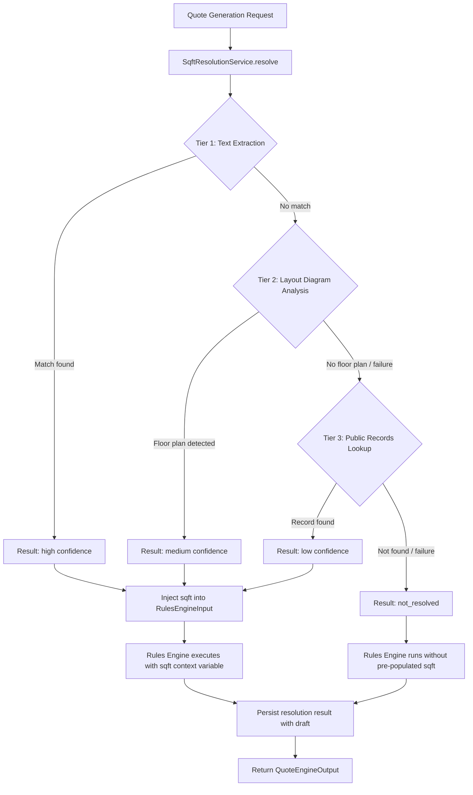
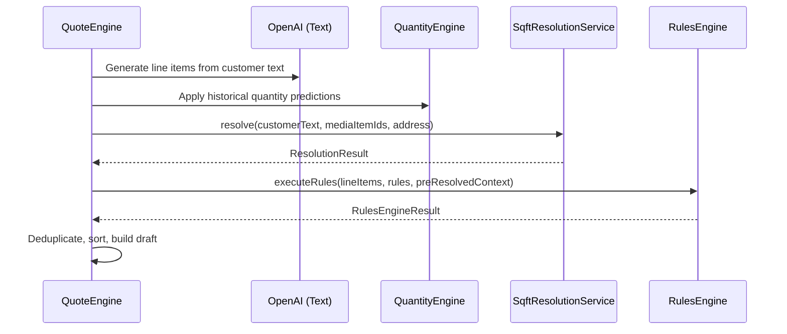

# Design Document: Square Footage Resolution

## Overview

This feature introduces a tiered resolution pipeline that determines property square footage from the best available source, then injects the resolved value into the existing rules engine as a pre-populated context variable. The pipeline runs during quote generation, before the rules engine, so that `compute_quantity` formulas referencing `sqft` have access to the resolved value without requiring the user to manually enter it or rely solely on regex extraction from request text.

The three resolution tiers, in priority order:

1. **Text Extraction (Tier 1, high confidence)** — Regex extraction from customer request text using the existing `sqft` extraction preset pattern. This is the most reliable source because the customer explicitly stated the value.
2. **Layout Diagram Analysis (Tier 2, medium confidence)** — AI vision analysis of attached images to estimate square footage from floor plans or blueprints. Uses the same OpenAI API already configured for text generation.
3. **Public Records Lookup (Tier 3, low confidence)** — Query the Cook County Assessor's open data portal for recorded building square footage by property address.

The resolution result (value, source tier, confidence, metadata) is persisted with the quote draft for display without re-computation. Manual override is supported, preserving the original resolution alongside the user-entered value.

### Design Rationale

- **Tiered priority with early exit**: The pipeline stops at the first tier that produces a value. This minimizes latency (no unnecessary AI calls or network requests) and ensures the most reliable source wins.
- **Graceful degradation**: Each tier is independently failable. If AI vision times out, the pipeline falls through to public records. If public records is unreachable, the result is "not resolved" — quote generation continues without blocking.
- **Pre-populated context variable**: Rather than modifying the rules engine's condition evaluation, the resolved sqft is injected as a pre-populated context variable. This means existing `request_text_extract` rules with the `sqft` preset automatically benefit without rule changes.
- **Persistence over re-computation**: The resolution result is stored with the draft. Loading a draft displays the stored result without re-running the pipeline (which could produce different results over time as public records update).

## Architecture



### Integration into Quote Generation Pipeline

The resolution service runs in `QuoteEngine.generateQuote()` after AI line item generation and quantity engine predictions, but **before** the rules engine:



### Key Architectural Decisions

1. **Resolution service is stateless** — It receives inputs and returns a result. No internal state or caching between calls. The result is persisted by the caller (QuoteEngine/QuoteDraftService).
2. **AI vision uses the same OpenAI API** — No new API keys or endpoints. The existing `AI_TEXT_API_KEY` and `AI_TEXT_API_URL` are reused with a vision-capable model (`gpt-4o`).
3. **Cook County data via Socrata SODA API** — The Cook County Assessor publishes property characteristics on their open data portal ([datacatalog.cookcountyil.gov](https://datacatalog.cookcountyil.gov)). The SODA API supports filtering by address fields and returns JSON. No API key required for public datasets (though rate-limited).
4. **Pre-resolved context passed as new field on RulesEngineInput** — A new optional `preResolvedContext` field carries the sqft value. The rules engine merges it into each rule's context variables before formula evaluation.
5. **Address resolution is a sub-step of Tier 3** — The service extracts the property address from Jobber client data, manual request fields, or free text before attempting the public records lookup.

## Components and Interfaces

### SqftResolutionService

New module: `worker/src/services/sqft-resolution-service.ts`

```typescript
export interface ResolutionContext {
  customerText: string;
  mediaItemIds: string[];
  jobberPropertyAddress?: string | null;
  manualRequestAddress?: string | null;
}

export type ResolutionTier = 'text_extraction' | 'layout_diagram' | 'public_records' | 'manual_override';
export type ResolutionConfidence = 'high' | 'medium' | 'low';

export interface ResolutionMetadata {
  matchedText?: string;           // Tier 1: the matched text segment
  imageId?: string;               // Tier 2: which image was analyzed
  aiReasoning?: string;           // Tier 2: AI explanation
  propertyAddress?: string;       // Tier 3: address used for lookup
  assessorRecordId?: string;      // Tier 3: Cook County record identifier
}

export interface ResolutionResult {
  resolved: boolean;
  value: number | null;
  tier: ResolutionTier | null;
  confidence: ResolutionConfidence | null;
  metadata: ResolutionMetadata;
}

export interface SqftResolutionResult {
  resolution: ResolutionResult;
  manualOverride: number | null;
  originalResolution: ResolutionResult | null;  // Preserved when override is applied
}

export class SqftResolutionService {
  private readonly apiKey: string;
  private readonly apiUrl: string;
  private readonly r2Bucket: R2Bucket;

  constructor(apiKey: string, apiUrl: string, r2Bucket: R2Bucket);

  /**
   * Resolve square footage through the tiered pipeline.
   * Returns immediately with a result — never throws.
   */
  async resolve(context: ResolutionContext): Promise<ResolutionResult>;

  /** Tier 1: Extract sqft from customer request text */
  extractFromText(text: string): ResolutionResult | null;

  /** Tier 2: Analyze images for floor plans via AI vision */
  private async analyzeLayoutDiagrams(mediaItemIds: string[]): Promise<ResolutionResult | null>;

  /** Tier 3: Look up property sqft from Cook County Assessor records */
  private async lookupPublicRecords(address: string): Promise<ResolutionResult | null>;
}
```

### Address Resolution Helper

```typescript
export interface AddressResolutionInput {
  jobberPropertyAddress?: string | null;
  manualRequestAddress?: string | null;
  customerText?: string;
}

/**
 * Resolve property address from available sources in priority order:
 * 1. Jobber client property address
 * 2. Manual request customer address
 * 3. Street address extracted from customer text (fallback)
 * Returns null if no address can be determined.
 */
export function resolvePropertyAddress(input: AddressResolutionInput): string | null;
```

### Cook County Assessor Client

New module: `worker/src/services/cook-county-assessor.ts`

```typescript
export interface AssessorPropertyRecord {
  pin: string;                    // 14-digit Property Index Number
  address: string;                // Full property address
  buildingSqft: number;           // Total building square footage
  propertyClass: string;          // Property classification code
  township: string;               // Township name
}

export class CookCountyAssessorClient {
  private static readonly BASE_URL = 'https://datacatalog.cookcountyil.gov/resource';
  private static readonly DATASET_ID = 'bcnq-qi2z';  // Single/Multi-Family Characteristics
  private static readonly TIMEOUT_MS = 8000;

  /**
   * Look up property characteristics by address.
   * Uses the Socrata SODA API with SoQL filtering on address fields.
   * Returns the most recent record with building square footage.
   * Returns null if no matching property is found or on error.
   */
  async lookupByAddress(address: string): Promise<AssessorPropertyRecord | null>;

  /**
   * Parse a street address into components for the SODA query.
   * Extracts house number and street name for filtering.
   */
  private parseAddress(address: string): { houseNumber: string; street: string; city?: string } | null;
}
```

The SODA API query format:
```
GET https://datacatalog.cookcountyil.gov/resource/bcnq-qi2z.json
  ?$where=char_hd_sf > 0
  &$select=pin,char_hd_sf,char_bldg_sf,class
  &$limit=5
  &$order=year DESC
  &pin=<PIN from address lookup>
```

The lookup requires a two-step process:
1. First, resolve the address to a PIN using the parcel addresses dataset
2. Then, query the characteristics dataset by PIN for building square footage

### Extended RulesEngineInput

```typescript
export interface RulesEngineInput {
  lineItems: EngineLineItem[];
  rules: StructuredRule[];
  catalog: ProductCatalogEntry[];
  customerRequestText?: string;
  maxIterations?: number;
  preResolvedContext?: Map<string, number>;  // NEW: pre-populated context variables
}
```

When `preResolvedContext` is provided, the rules engine merges these values into each rule's context variable map during condition evaluation. If a rule has a `request_text_extract` condition for a variable that already exists in `preResolvedContext`, the pre-resolved value takes precedence (the extraction is skipped for that variable).

### Extended QuoteDraft Type

```typescript
export interface QuoteDraft {
  // ... existing fields ...
  sqftResolution?: SqftResolutionResult | null;
}
```

### API Endpoints

**Manual override endpoint** (extends existing `PATCH /api/quote-drafts/:id`):

The existing `QuoteDraftUpdate` type gains a new optional field:

```typescript
export interface QuoteDraftUpdate {
  // ... existing fields ...
  sqftOverride?: number | null;  // Set to override, null to clear
}
```

## Data Models

### Database Changes

A new column on the `quote_drafts` table stores the resolution result as JSON:

```sql
-- Migration: 00XX_sqft_resolution.sql
ALTER TABLE quote_drafts ADD COLUMN sqft_resolution_json TEXT DEFAULT NULL;
```

The JSON structure stored in `sqft_resolution_json`:

```json
{
  "resolution": {
    "resolved": true,
    "value": 1500,
    "tier": "text_extraction",
    "confidence": "high",
    "metadata": {
      "matchedText": "1500 sqft"
    }
  },
  "manualOverride": null,
  "originalResolution": null
}
```

When a manual override is applied:

```json
{
  "resolution": {
    "resolved": true,
    "value": 1800,
    "tier": "manual_override",
    "confidence": "high",
    "metadata": {}
  },
  "manualOverride": 1800,
  "originalResolution": {
    "resolved": true,
    "value": 1500,
    "tier": "text_extraction",
    "confidence": "high",
    "metadata": {
      "matchedText": "1500 sqft"
    }
  }
}
```

### Type Definitions (shared/src/types/quote.ts)

```typescript
// New types for sqft resolution
export type ResolutionTier = 'text_extraction' | 'layout_diagram' | 'public_records' | 'manual_override';
export type ResolutionConfidence = 'high' | 'medium' | 'low';

export interface ResolutionMetadata {
  matchedText?: string;
  imageId?: string;
  aiReasoning?: string;
  propertyAddress?: string;
  assessorRecordId?: string;
}

export interface ResolutionResult {
  resolved: boolean;
  value: number | null;
  tier: ResolutionTier | null;
  confidence: ResolutionConfidence | null;
  metadata: ResolutionMetadata;
}

export interface SqftResolutionResult {
  resolution: ResolutionResult;
  manualOverride: number | null;
  originalResolution: ResolutionResult | null;
}
```

### Data Flow

1. **Quote generation** → `SqftResolutionService.resolve()` produces a `ResolutionResult`
2. **Rules engine** → The resolved value (if any) is passed as `preResolvedContext: new Map([['sqft', value]])`
3. **Persistence** → The `SqftResolutionResult` is serialized to JSON and stored in `sqft_resolution_json`
4. **Draft load** → The JSON is deserialized and returned as `draft.sqftResolution`
5. **Manual override** → The API endpoint updates `sqft_resolution_json` with the override value and preserves the original
6. **Override clear** → The API endpoint restores the original resolution and clears the override


## Correctness Properties

*A property is a characteristic or behavior that should hold true across all valid executions of a system — essentially, a formal statement about what the system should do. Properties serve as the bridge between human-readable specifications and machine-verifiable correctness guarantees.*

### Property 1: Tier Priority Ordering

*For any* resolution context where multiple tiers could produce a value, the resolution service SHALL return the result from the highest-priority tier (text extraction > layout diagram > public records), and lower-priority tiers SHALL not be invoked once a higher-priority tier succeeds.

**Validates: Requirements 1.1, 1.2, 1.3, 1.4, 1.5**

### Property 2: Text Extraction Correctness

*For any* customer request text containing a numeric value (integer or decimal, with optional comma separators) followed by a square footage indicator (sqft, sq ft, square feet, sf), the text extraction tier SHALL produce a result with the correct numeric value, confidence "high", and the matched text segment recorded in metadata.

**Validates: Requirements 2.1, 2.2, 2.4, 2.5**

### Property 3: First Match Extraction

*For any* customer request text containing two or more square footage values, the text extraction tier SHALL extract the value from the first (leftmost) match in the text.

**Validates: Requirements 2.3**

### Property 4: Pre-Resolved Context Variable Availability

*For any* resolved square footage value (from any tier or manual override), when passed to the rules engine as a pre-resolved context variable, all `compute_quantity` formulas referencing `sqft` SHALL evaluate using that value, and rules with `request_text_extract` conditions for the `sqft` preset SHALL use the pre-resolved value rather than re-extracting.

**Validates: Requirements 5.1, 5.2, 7.2**

### Property 5: Manual Override Round-Trip

*For any* resolution result and any manual override value, applying the override SHALL set the active value to the override, preserve the original resolution result, and clearing the override SHALL restore the original resolution as the active value.

**Validates: Requirements 7.1, 7.3, 7.4**

### Property 6: Address Resolution Priority

*For any* set of address sources (Jobber property address, manual request address, text-extracted address), the address resolver SHALL return the highest-priority available address (Jobber > manual > text extraction), and return null only when no source provides an address.

**Validates: Requirements 4.2, 9.1, 9.2, 9.3, 9.4**

### Property 7: Resolution Source in Audit Trail

*For any* `compute_quantity` action that references the `sqft` variable and uses a pre-resolved value, the audit trail entry SHALL include the resolution source tier in its metadata.

**Validates: Requirements 8.4**

## Error Handling

### Tier-Level Error Handling

| Tier | Error Condition | Behavior | Result |
|------|----------------|----------|--------|
| 1 (Text) | No sqft pattern match | Skip tier | Fall through to Tier 2 |
| 1 (Text) | Regex execution error | Skip tier, log warning | Fall through to Tier 2 |
| 2 (Vision) | AI API timeout (>15s) | Skip tier | Fall through to Tier 3 |
| 2 (Vision) | AI API error (4xx/5xx) | Skip tier, log warning | Fall through to Tier 3 |
| 2 (Vision) | No images attached | Skip tier | Fall through to Tier 3 |
| 2 (Vision) | AI says "not a floor plan" | Skip tier | Fall through to Tier 3 |
| 2 (Vision) | R2 image fetch failure | Skip tier, log warning | Fall through to Tier 3 |
| 3 (Records) | No address available | Skip tier | Result: not_resolved |
| 3 (Records) | SODA API timeout (>8s) | Skip tier, log warning | Result: not_resolved |
| 3 (Records) | SODA API error | Skip tier, log warning | Result: not_resolved |
| 3 (Records) | No matching property | Skip tier | Result: not_resolved |
| 3 (Records) | Address parse failure | Skip tier | Result: not_resolved |

### Service-Level Error Handling

- The `SqftResolutionService.resolve()` method **never throws**. All errors are caught internally and result in graceful fallthrough or a "not_resolved" result.
- If the entire resolution pipeline fails unexpectedly, quote generation continues without a pre-populated sqft variable (the rules engine falls back to its existing `request_text_extract` behavior).
- Errors are logged via `console.warn` for observability but do not surface to the user as error toasts.

### Manual Override Validation

| Error Condition | Behavior |
|----------------|----------|
| Override value ≤ 0 | Reject with 400: "Square footage must be a positive number" |
| Override value > 100,000 | Reject with 400: "Square footage value seems unreasonably large" |
| Override value is not a number | Reject with 400: "Enter a valid number for square footage" |
| Draft not found | Reject with 404 |

### API Error Responses

All errors follow the existing `PlatformError` pattern with `severity`, `component`, `operation`, `description`, and `recommendedActions`.

## Testing Strategy

### Property-Based Tests (fast-check)

The feature is well-suited for property-based testing because:
- The text extraction tier is a pure function with clear input/output behavior
- The tier priority logic has universal properties that hold across all valid inputs
- The override round-trip is a classic algebraic property
- The address resolution logic is a pure function with multiple input sources

**Library**: fast-check (already in use)
**Minimum iterations**: 100 per property test
**Tag format**: `Feature: sqft-resolution, Property {N}: {title}`

Property tests to implement:
1. **Tier priority ordering** — Generate resolution contexts with various tier availability combinations (mocked tier functions), verify highest-priority tier always wins and lower tiers are not called
2. **Text extraction correctness** — Generate texts with embedded sqft values in various formats (integers, decimals, commas, different suffixes), verify correct numeric extraction and metadata
3. **First match extraction** — Generate texts with multiple sqft values at random positions, verify first match is always chosen
4. **Pre-resolved context in rules engine** — Generate sqft values and `compute_quantity` formulas referencing `sqft`, verify the pre-resolved value is used and existing extraction is skipped
5. **Override round-trip** — Generate resolution results and override values, verify apply then clear restores original
6. **Address resolution priority** — Generate combinations of Jobber/manual/text addresses (some null, some present), verify priority ordering
7. **Audit trail source inclusion** — Generate scenarios with pre-resolved sqft used in formulas, verify audit trail metadata includes resolution tier

### Unit Tests (Vitest)

Unit tests for specific examples and edge cases:
- Cook County Assessor client: mocked HTTP responses for found/not-found/error/timeout cases
- AI vision analysis: mocked OpenAI responses for floor plan detected/not detected/error/timeout
- Text extraction with each documented format ("1500 sqft", "1,500 sq ft", "1500 square feet", "1500sf")
- Address parsing edge cases (apartment numbers, suite numbers, PO boxes rejected)
- Manual override validation (boundary values: 0, -1, 100001, NaN)
- Resolution result JSON serialization/deserialization
- Integration with QuoteEngine.generateQuote() pipeline ordering
- Graceful degradation: each tier failing independently

### Integration Tests

- End-to-end quote generation with text containing sqft → verify resolution result persisted and rules engine uses value
- Manual override via PATCH API → verify draft update and subsequent rule evaluation uses override
- Quote draft load → verify persisted resolution displayed without re-computation

### Test File Locations

- `tests/property/sqft-resolution.property.test.ts` — Property-based tests
- `tests/unit/sqft-resolution-service.test.ts` — Unit tests for resolution pipeline
- `tests/unit/cook-county-assessor.test.ts` — Unit tests for public records client
- `tests/unit/address-resolution.test.ts` — Unit tests for address extraction
